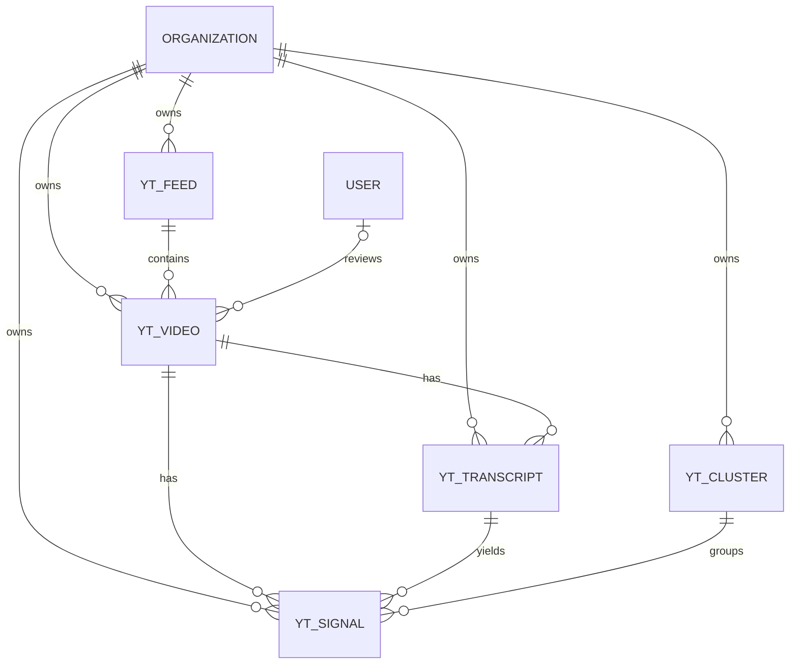
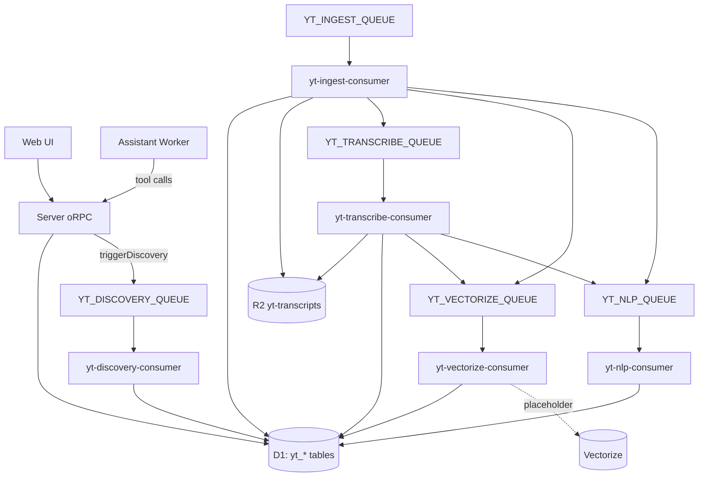

# Current State (As Implemented)

Snapshot date: 2026-02-22

## Scope
This is the **actual implemented state** of the YouTube playtest subsystem in this repo (not target architecture).

## Monorepo Modules Involved
- `packages/db`: Drizzle schema + migrations (`yt_feed`, `yt_video`, `yt_transcript`, `yt_signal`, `yt_cluster`)
- `packages/api`: oRPC contracts + routers (`youtube.*`)
- `packages/youtube`: Node utilities (`search`, `metadata`, `subtitles`, `download-audio`, `transcribe`)
- `packages/assistant`: assistant router + YouTube tools that call server oRPC
- `apps/server`: queue consumers + queue routing
- `packages/infra`: Cloudflare resources (D1, R2, queues, Vectorize binding)
- `apps/web`: YouTube feeds/videos/insights UI routes

## Domain Schema (D1)

### Tables
- `yt_feed`: search feed config per org/game
  - key fields: `name`, `gameTitle`, `searchQuery`, `stopWords`, `publishedAfter`, `gameVersion`, `scheduleHint`, `status`, `lastDiscoveryAt`
- `yt_video`: discovered/submitted videos
  - key fields: `feedId`, `youtubeVideoId`, metadata fields, `status`, review fields, ingest/failure fields
  - unique: `(feed_id, youtube_video_id)`
- `yt_transcript`: transcript artifacts per video
  - key fields: `source`, `language`, `r2Key`, `fullText`, `durationSeconds`, `segmentCount`, `tokenCount`
- `yt_signal`: atomic NLP feedback units
  - key fields: `type`, `severity`, `text`, `contextBefore/After`, `timestampStart/End`, `confidence`, `component`, `gameVersion`, `clusterId`, `vectorized`, `embeddingModel`
- `yt_cluster`: grouped issues/insights
  - key fields: `title`, `summary`, `state`, `type`, `severity`, `signalCount`, `uniqueAuthors`, `impactScore`, version fields, external issue link/id

### Enums
- Feed status: `active | paused | archived`
- Video status: `candidate | approved | rejected | ingesting | ingested | failed`
- Transcript source: `youtube_captions | whisper_asr | manual`
- Signal type: `bug | ux_friction | confusion | praise | suggestion | performance | crash | exploit | other`
- Severity: `critical | high | medium | low | info`
- Cluster state: `open | acknowledged | in_progress | fixed | ignored | regression`

### Data Model Diagram

## API / Assistant Surface

### oRPC (`packages/api/src/routers/youtube/index.ts`)
- Feeds: `create`, `update`, `list`, `delete`
- Videos: `submit`, `review`, `list`, `triggerDiscovery`
- Signals: `list`
- Clusters: `list`, `updateState`
- Search: `semantic` (currently LIKE-based fallback)

### Assistant tools (`packages/assistant/src/tools/youtube/*`)
- `ytSearchSignals`, `ytSearchYouTube`
- `ytListVideos`, `ytListClusters`
- `ytSubmitVideo`, `ytTriggerDiscovery`, `ytUpdateClusterState`

## Infrastructure / Runtime Wiring

### Provisioned resources (`packages/infra/alchemy.run.ts`)
- D1 DB
- R2 bucket: `yt-transcripts`
- Queues + DLQ:
  - `yt-discovery`, `yt-ingest`, `yt-vectorize`, `yt-nlp`, `yt-transcribe`
- Vectorize index: `yt-signals` (1536 dims, cosine)

### Consumers (`apps/server/src/queues`)
- `yt-discovery-consumer`: validates message, loads feed, updates `lastDiscoveryAt` (search/insert not yet implemented)
- `yt-ingest-consumer`: placeholder ingest flow; creates transcript; dispatches to transcribe or nlp/vectorize
- `yt-transcribe-consumer`: reads audio from R2; placeholder transcript update; dispatches nlp/vectorize
- `yt-nlp-consumer`: placeholder signal extraction (creates one placeholder signal)
- `yt-vectorize-consumer`: marks signals as vectorized (embedding/upsert placeholder)

### Runtime Flow Diagram (Current)

## What Is Present vs Placeholder
- Implemented:
  - Strong base schema for feeds/videos/transcripts/signals/clusters
  - Org-scoped permissions for YouTube resources
  - Queue contracts and consumers with retry/ack patterns
  - UI pages for feeds/videos/insights
  - Assistant tools wired to oRPC
- Placeholder / not fully wired:
  - No FTS5 virtual table yet (search uses `LIKE`)
  - Semantic search endpoint is not vector search yet
  - Discovery consumer does not persist candidates from YouTube search yet
  - NLP/vector/transcribe are scaffolded with placeholder logic
  - No cluster queue/consumer implemented
  - `triggerDiscovery` expects `context.ytDiscoveryQueue`, but API context currently only wires notification/recurring queues
  - `videos.review(approve)` does not enqueue ingest automatically
